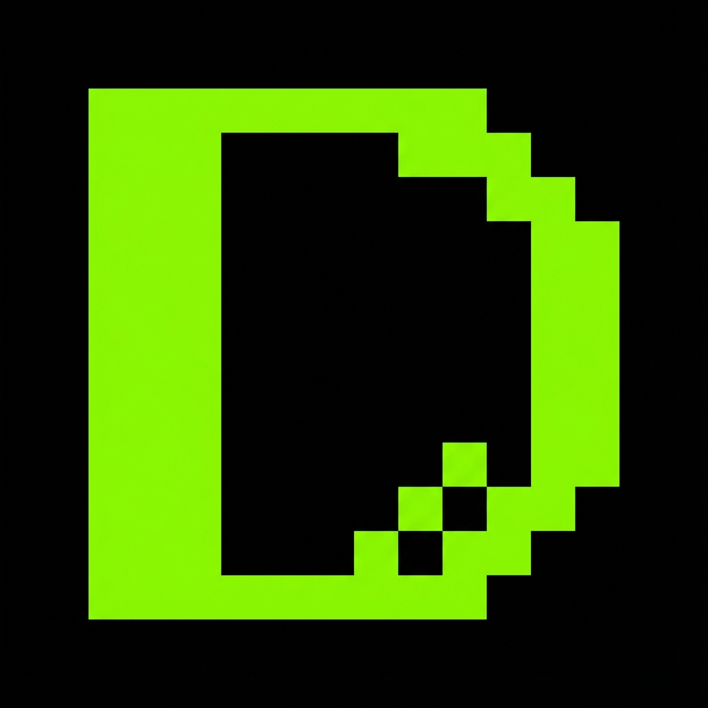

# DreamFlows

A minimalist ambient focus timer with infinite generative music, built with Vanilla JavaScript and Tone.js.



## Features

### 🎵 Infinite Generative Audio
- **Phasing Loops**: Uses prime number intervals (7, 11, 13 beats) to create non-repeating, ever-evolving soundscapes
- **Low Cognitive Load**: Pure sine waves with heavy low-pass filtering to remove distracting frequencies
- **Focus-Optimized**: C Minor Pentatonic scale and ambient chord progressions designed for deep work

### ⏱️ Time Flux UX
- **Drag to Set**: Click and drag vertically on the massive timer to change duration (1-120 minutes)
- **Click to Toggle**: Single click starts/stops the timer
- **Spacebar Control**: Press space to quickly start/stop
- **Glitch Confirmation**: Subtle visual feedback when changing time

### 🎨 Neo-Brutalist Design
- **Typographic Wall**: Massive, centered timer display
- **High Contrast**: Acid lime (#ccff00) on black
- **Noise Texture**: Subtle grain overlay
- **Minimal UI**: "The Corners" navigation topology

## Tech Stack

- **Vanilla JavaScript** - No frameworks, lightweight and fast
- **Tone.js** - Web Audio API wrapper for generative music
- **Space Grotesk** - Google Fonts typography
- **HTML5 Canvas** - Real-time visualizer

## Getting Started

1. Clone the repository:
   ```bash
   git clone https://github.com/charrlodin/dream-flows.git
   cd dream-flows
   ```

2. Open `index.html` in your browser - that's it!

## Usage

- **Set Time**: Drag the timer up/down
- **Start/Stop**: Click the timer or press Spacebar
- **Volume**: Click the settings icon (top right) to adjust
- **Visualizer**: Subtle glitch lines appear when the timer is active

## License

MIT License - See [LICENSE](LICENSE) for details

## Support

If you find this useful, consider supporting the project:

- ⭐ Star this repo
- ☕ [Buy me a coffee](https://ko-fi.com/looplaps)

## Inspiration

Built as a tool to solve the constant distraction problem during deep work sessions. Inspired by Brian Eno's phasing logic and the DevFocus project.

---

Made with ❤️ by [charrlodin](https://github.com/charrlodin)
